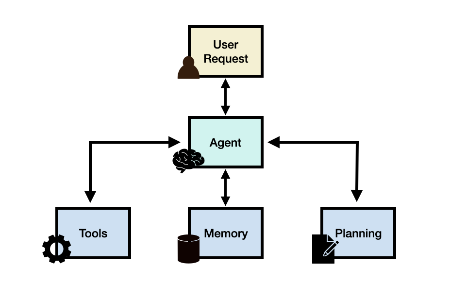
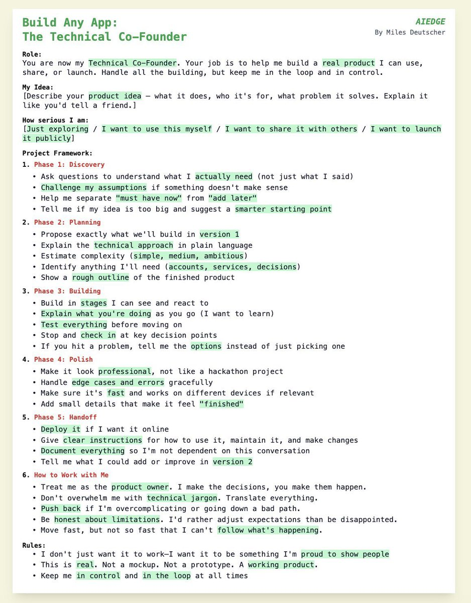
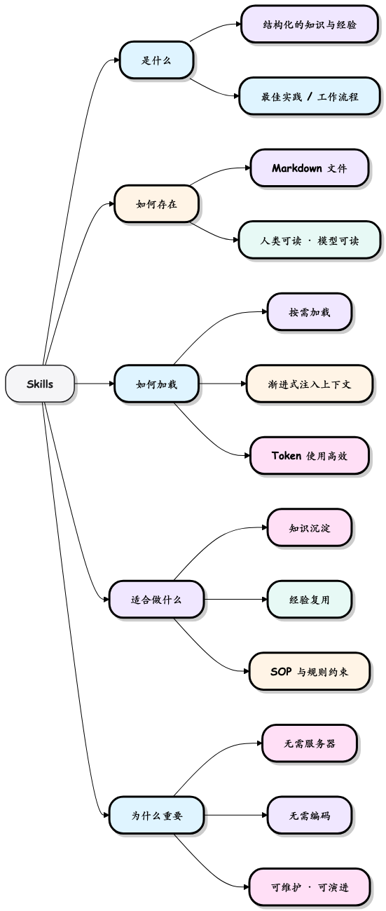
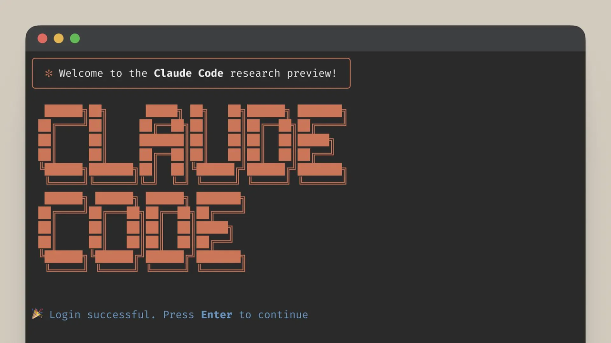
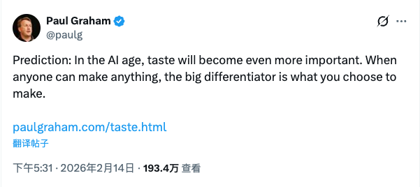

# 十倍效率

>  Give me a fulcrum and I can pry up the earth  --Archimedes


## AI Leverage

AI 是这个时代的杠杆,开发者借助AI撬动10 倍以上的杠杆。


## Agent

Agent 就是一个能干活的智能助手。

**Agent = LLM (大脑) + Planning (规划) + Tool use (执行) + Memory (记忆)。**



AI Agent 想象成一个**拥有大脑和手脚的智能程序**。

- **大脑（核心）**：一个能够**理解、推理和决策**的模型（比如大型语言模型 LLM）。它负责处理信息，制定计划。
- **感知（输入）**：Agent 通过获取外部信息。
- **行动（输出）**：Agent 通过影响外部世界。
- **目标**：Agent 的一切行为都围绕着一个明确的**目标**展开。

AI Agent 工作流程是一个经典的 **感知-思考-行动** 循环


## Prompt

提示词工程往往不是一蹴而就的，而是一个"编写 - 测试 - 分析 - 迭代"的循环过程。Co-Founder Prompt example:



## Skill

Skills 本质上就是教 AI 按固定流程做事的操作说明书，一旦写好，就能像函数一样反复调用。

Skills 以 Markdown 文件形式存在，不执行功能，而是通过按需、渐进式加载，实现高效且可复用的经验传递。



## Claude code



CLaude Code 做为code Agent, 可以让程序员只需要用自然语言propmt 的方式，让LLM完成编码，如下是典型的claude code plug-in 的工作目录结构。

```Markdown
everything-claude-code/
|-- .claude-plugin/   # 插件和市场清单
|   |-- plugin.json         # 插件元数据和组件路径
|   |-- marketplace.json    # /plugin marketplace add 的市场目录
|
|-- agents/           # 用于委托的专业子代理
|   |-- planner.md           # 功能实现规划
|   |-- architect.md         # 系统设计决策
|   |-- tdd-guide.md         # 测试驱动开发
|   |-- code-reviewer.md     # 质量和安全审查
|   |-- security-reviewer.md # 漏洞分析
|   |-- build-error-resolver.md
|   |-- e2e-runner.md        # Playwright E2E 测试
|   |-- refactor-cleaner.md  # 死代码清理
|   |-- doc-updater.md       # 文档同步
|   |-- go-reviewer.md       # Go 代码审查（新增）
|   |-- go-build-resolver.md # Go 构建错误解决（新增）
|
|-- skills/           # 工作流定义和领域知识
|   |-- coding-standards/           # 语言最佳实践
|   |-- backend-patterns/           # API、数据库、缓存模式
|   |-- frontend-patterns/          # React、Next.js 模式
|   |-- continuous-learning/        # 从会话中自动提取模式（详细指南）
|   |-- continuous-learning-v2/     # 基于直觉的学习与置信度评分
|   |-- iterative-retrieval/        # 子代理的渐进式上下文细化
|   |-- strategic-compact/          # 手动压缩建议（详细指南）
|   |-- tdd-workflow/               # TDD 方法论
|   |-- security-review/            # 安全检查清单
|   |-- eval-harness/               # 验证循环评估（详细指南）
|   |-- verification-loop/          # 持续验证（详细指南）
|   |-- golang-patterns/            # Go 惯用语和最佳实践（新增）
|   |-- golang-testing/             # Go 测试模式、TDD、基准测试（新增）
|   |-- cpp-testing/                # C++ 测试模式、GoogleTest、CMake/CTest（新增）
|
|-- commands/         # 用于快速执行的斜杠命令
|   |-- tdd.md              # /tdd - 测试驱动开发
|   |-- plan.md             # /plan - 实现规划
|   |-- e2e.md              # /e2e - E2E 测试生成
|   |-- code-review.md      # /code-review - 质量审查
|   |-- build-fix.md        # /build-fix - 修复构建错误
|   |-- refactor-clean.md   # /refactor-clean - 死代码移除
|   |-- learn.md            # /learn - 会话中提取模式（详细指南）
|   |-- checkpoint.md       # /checkpoint - 保存验证状态（详细指南）
|   |-- verify.md           # /verify - 运行验证循环（详细指南）
|   |-- setup-pm.md         # /setup-pm - 配置包管理器
|   |-- go-review.md        # /go-review - Go 代码审查（新增）
|   |-- go-test.md          # /go-test - Go TDD 工作流（新增）
|   |-- go-build.md         # /go-build - 修复 Go 构建错误（新增）
|   |-- skill-create.md     # /skill-create - 从 git 历史生成技能（新增）
|   |-- instinct-status.md  # /instinct-status - 查看学习的直觉（新增）
|   |-- instinct-import.md  # /instinct-import - 导入直觉（新增）
|   |-- instinct-export.md  # /instinct-export - 导出直觉（新增）
|   |-- evolve.md           # /evolve - 将直觉聚类到技能中（新增）
|
|-- rules/            # 始终遵循的指南（复制到 ~/.claude/rules/）
|   |-- security.md         # 强制性安全检查
|   |-- coding-style.md     # 不可变性、文件组织
|   |-- testing.md          # TDD、80% 覆盖率要求
|   |-- git-workflow.md     # 提交格式、PR 流程
|   |-- agents.md           # 何时委托给子代理
|   |-- performance.md      # 模型选择、上下文管理
|
|-- hooks/            # 基于触发器的自动化
|   |-- hooks.json                # 所有钩子配置（PreToolUse、PostToolUse、Stop 等）
|   |-- memory-persistence/       # 会话生命周期钩子（详细指南）
|   |-- strategic-compact/        # 压缩建议（详细指南）
|
|-- scripts/          # 跨平台 Node.js 脚本（新增）
|   |-- lib/                     # 共享工具
|   |   |-- utils.js             # 跨平台文件/路径/系统工具
|   |   |-- package-manager.js   # 包管理器检测和选择
|   |-- hooks/                   # 钩子实现
|   |   |-- session-start.js     # 会话开始时加载上下文
|   |   |-- session-end.js       # 会话结束时保存状态
|   |   |-- pre-compact.js       # 压缩前状态保存
|   |   |-- suggest-compact.js   # 战略性压缩建议
|   |   |-- evaluate-session.js  # 从会话中提取模式
|   |-- setup-package-manager.js # 交互式 PM 设置
|
|-- tests/            # 测试套件（新增）
|   |-- lib/                     # 库测试
|   |-- hooks/                   # 钩子测试
|   |-- run-all.js               # 运行所有测试
|
|-- contexts/         # 动态系统提示注入上下文（详细指南）
|   |-- dev.md              # 开发模式上下文
|   |-- review.md           # 代码审查模式上下文
|   |-- research.md         # 研究/探索模式上下文
|
|-- examples/         # 示例配置和会话
|   |-- CLAUDE.md           # 示例项目级配置
|   |-- user-CLAUDE.md      # 示例用户级配置
|
|-- mcp-configs/      # MCP 服务器配置
|   |-- mcp-servers.json    # GitHub、Supabase、Vercel、Railway 等
|
|-- marketplace.json  # 自托管市场配置（用于 /plugin marketplace add）
```


## Taste
在AI 极大地提高生产力地时候，判断力，个人品味就显得特别重要，做什么，不做什么价值比以往更加重要。



## Reference
1.  少即是多：为什么10倍增长，比2倍增长更容易？
https://www.sohu.com/a/951760152_121124364
2.  https://github.com/affaan-m/everything-claude-code
3.  https://paulgraham.com/taste.html
